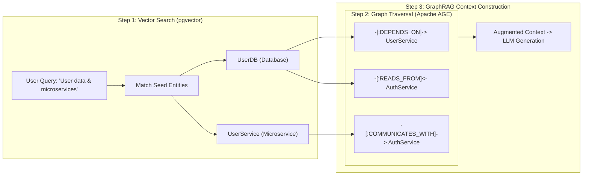

# GraphRAG Demystified: Building Hybrid Knowledge Graphs with PostgreSQL, Apache AGE, and pgvector


Have you ever asked a standard RAG pipeline a question about your system architecture or enterprise knowledge base, only to receive a completely blind, half-baked answer?

You scramble to optimize your vector chunk sizes, tweak your top-$k$ similarity thresholds, or re-embed your entire document corpus. But no matter how much you tune cosine similarity, your LLM still fails to understand *how* entity A connects to entity B across multiple hops.

That's the fundamental blind spot of traditional vector-only Retrieval-Augmented Generation (RAG). Vectors are great at finding semantically similar text snippets, but they are completely blind to structural relationships, multi-hop dependencies, and system topologies.

In this post, we're going to explore **GraphRAG**—a hybrid approach that combines Knowledge Graphs with Vector Embeddings. Even better, we'll implement a complete, practical GraphRAG pipeline using a **single database: PostgreSQL**, equipped with **Apache AGE** (for Cypher graph queries) and **pgvector** (for vector similarity search), deployed cleanly with **Docker Compose**.

No need to run Neo4j, Pinecone, and Postgres side-by-side. Just good old PostgreSQL doing it all. 🙂

---

## Understanding GraphRAG through a Detective's Evidence Board

Ok, but what is GraphRAG? Looking at the literature, it can sound overly theoretical. To make this crystal clear, let's imagine solving a complex mystery using a detective's workspace:

* **Traditional Vector RAG (The Case File Drawer):** Imagine having thousands of isolated witness statements stored in a filing cabinet. When you ask, *"Who supplied the getaway car?"*, vector search finds folders that mention "car", "driving", or "vehicle". But if Witness A saw the car near a warehouse, and Document B links the warehouse to Suspect X, vector search alone won't connect those dots because neither document explicitly mentions Suspect X driving the car.
* **Knowledge Graph (The String-Tangled Pin Board):** This is the classic detective board on the wall. Pins represent entities (*Suspect X*, *Red Sedan*, *Warehouse*), and strings represent relationships (*OWNED_BY*, *PARKED_AT*, *SEEN_NEAR*).
* **GraphRAG (The Hybrid Detective):** GraphRAG uses vector similarity to find the most relevant "pins" on the board based on your question, and then instantly follows the red strings (graph edges) to extract the full connected context before handing it to the LLM.



By combining vector search with graph traversal, our LLM gets both semantic relevance *and* exact relationship topology!

---

## Prerequisites & Infrastructure Setup

We'll deploy our entire stack with Docker Compose. Our setup consists of PostgreSQL 16 compiled with both the **pgvector** extension and the **Apache AGE** graph extension.

Here is our clean directory layout:

```text
graphrag/
├── Dockerfile
├── docker-compose.yml
├── init.sql
├── requirements.txt
└── demo.py
```

Let's break down each file in our workspace before spinning up the container.

### 1. The Dockerfile (`Dockerfile`)

We start with an official PostgreSQL 16 base image and build `pgvector` and `apache-age` directly from source:

```dockerfile
# Dockerfile
FROM postgres:16

# Install build dependencies
RUN apt-get update && apt-get install -y --no-install-recommends \
    build-essential \
    postgresql-server-dev-16 \
    git \
    bison \
    flex \
    ca-certificates \
    && rm -rf /var/lib/apt/lists/*

# Install pgvector (v0.7.4)
RUN git clone --branch v0.7.4 https://github.com/pgvector/pgvector.git /tmp/pgvector \
    && make -C /tmp/pgvector \
    && make -C /tmp/pgvector install \
    && rm -rf /tmp/pgvector

# Install Apache AGE (PG16 compatible release)
RUN git clone --branch PG16/v1.5.0-rc0 https://github.com/apache/age.git /tmp/age \
    && make -C /tmp/age PG_CONFIG=/usr/lib/postgresql/16/bin/pg_config install \
    && rm -rf /tmp/age

# Copy initialization script
COPY init.sql /docker-entrypoint-initdb.d/01-init.sql
```

> [!NOTE]
> We specifically use Apache AGE version `PG16/v1.5.0-rc0` to match PostgreSQL 16. If you're using an older Postgres major version (e.g., PostgreSQL 15), make sure to target the matching release branch from the Apache AGE repository.

### 2. The Database Initialization Script (`init.sql`)

When PostgreSQL boots up, `init.sql` automatically enables both extensions, sets up the `ag_catalog` search path, initializes our Apache AGE graph (`tech_graph`), and creates a relational table with an HNSW vector index for entity embeddings:

```sql
-- init.sql
-- Enable required extensions
CREATE EXTENSION IF NOT EXISTS age;
CREATE EXTENSION IF NOT EXISTS vector;

-- Set search path so ag_catalog is available globally across client sessions
ALTER DATABASE graphrag_db SET search_path = ag_catalog, "$user", public;
SET search_path = ag_catalog, "$user", public;

-- Load Apache AGE module into initialization session
LOAD 'age';

-- Initialize Knowledge Graph
SELECT create_graph('tech_graph');

-- Table storing vector embeddings for entities (using 384 dimensions for all-MiniLM-L6-v2)
CREATE TABLE IF NOT EXISTS entity_embeddings (
    id SERIAL PRIMARY KEY,
    entity_name VARCHAR(255) UNIQUE NOT NULL,
    entity_type VARCHAR(100) NOT NULL,
    description TEXT NOT NULL,
    embedding vector(384)
);

-- Create HNSW Index for fast Cosine Distance vector queries
CREATE INDEX IF NOT EXISTS idx_entity_embeddings_cosine 
ON entity_embeddings USING hnsw (embedding vector_cosine_ops);
```

### 3. The Docker Compose Specification (`docker-compose.yml`)

Next, we define our service in `docker-compose.yml`:

```yaml
# docker-compose.yml
services:
  graphrag-db:
    build:
      context: .
      dockerfile: Dockerfile
    container_name: graphrag_postgres
    environment:
      POSTGRES_USER: postgres
      POSTGRES_PASSWORD: postgrespassword
      POSTGRES_DB: graphrag_db
    ports:
      - "5432:5432"
    volumes:
      - pgdata:/var/lib/postgresql/data
    healthcheck:
      test: ["CMD-SHELL", "pg_isready -U postgres -d graphrag_db"]
      interval: 5s
      timeout: 5s
      retries: 5

volumes:
  pgdata:
```

### 4. Python Dependencies (`requirements.txt`)

Our Python pipeline requires `psycopg2-binary` for database access, `pgvector` for vector adapter bindings, and `sentence-transformers` for embedding generation:

```text
psycopg2-binary==2.9.9
pgvector==0.3.2
sentence-transformers==3.0.1
numpy==1.26.4
```

---

## Launching the Stack

Once all this is set up, we'll start our compose. We'll run it in detached mode so we can monitor the logs:

```bash
docker compose up -d --build
```

Now let's create and activate a Python virtual environment, and install our dependencies:

```bash
python3 -m venv venv
source venv/bin/activate
# venv\Scripts\activate on Windows

pip install -r requirements.txt
```

---

## The Python GraphRAG Pipeline

Now for the fun part! Let's build `demo.py`, which populates a microservice architecture knowledge graph into Apache AGE, computes vector embeddings for each entity using `SentenceTransformer`, and executes a two-stage **GraphRAG retrieval pipeline**.

```python
# demo.py
import psycopg2
from pgvector.psycopg2 import register_vector
from sentence_transformers import SentenceTransformer
import time

# 1. Initialize local embedding model (384 dimensions, fast & lightweight)
print("Loading embedding model (all-MiniLM-L6-v2)...")
embedder = SentenceTransformer("all-MiniLM-L6-v2", device="cpu")

def get_db_connection():
    max_retries = 10
    for i in range(max_retries):
        try:
            conn = psycopg2.connect(
                dbname="graphrag_db",
                user="postgres",
                password="postgrespassword",
                host="localhost",
                port="5432"
            )
            conn.autocommit = True
            register_vector(conn)
            return conn
        except Exception as e:
            if i == max_retries - 1:
                raise e
            print(f"Waiting for database connection... ({i+1}/{max_retries})")
            time.sleep(2)

def setup_graph_and_vector_data(conn):
    cur = conn.cursor()
    cur.execute("LOAD 'age';")
    cur.execute("SET search_path = ag_catalog, '$user', public;")
    
    print("\n--- 1. Populating Graph Data via Apache AGE (Cypher) ---")
    
    try:
        cur.execute("SELECT drop_graph('tech_graph', true);")
    except Exception:
        pass
    cur.execute("SELECT create_graph('tech_graph');")
    
    # Define Entities (Nodes)
    entities = [
        {"name": "AuthService", "type": "Microservice", "desc": "Handles JWT authentication, password verification, and token issuance."},
        {"name": "UserService", "type": "Microservice", "desc": "Manages user profiles, preferences, and account metadata."},
        {"name": "PaymentService", "type": "Microservice", "desc": "Processes customer credit card payments and subscription billing."},
        {"name": "UserDB", "type": "Database", "desc": "PostgreSQL database storing encrypted user credentials and account profiles."},
        {"name": "PaymentGateway", "type": "ExternalAPI", "desc": "Third-party Stripe REST API integration for credit card processing."},
        {"name": "KafkaBroker", "type": "EventBus", "desc": "Apache Kafka message broker for asynchronous event processing."}
    ]
    
    for entity in entities:
        cypher = f"""
        SELECT * FROM cypher('tech_graph', $$
            CREATE (n:{entity['type']} {{name: '{entity['name']}', description: '{entity['desc']}'}})
            RETURN n
        $$) as (n agtype);
        """
        cur.execute(cypher)
        print(f"Created Node: {entity['name']} ({entity['type']})")

    # Define Relationships (Edges)
    relationships = [
        ("UserService", "DEPENDS_ON", "UserDB"),
        ("AuthService", "READS_FROM", "UserDB"),
        ("AuthService", "COMMUNICATES_WITH", "UserService"),
        ("PaymentService", "CALLS", "PaymentGateway"),
        ("PaymentService", "PUBLISHES_TO", "KafkaBroker"),
        ("UserService", "SUBSCRIBES_TO", "KafkaBroker")
    ]
    
    for src, rel, target in relationships:
        cypher = f"""
        SELECT * FROM cypher('tech_graph', $$
            MATCH (a {{name: '{src}'}}), (b {{name: '{target}'}})
            CREATE (a)-[r:{rel}]->(b)
            RETURN r
        $$) as (r agtype);
        """
        cur.execute(cypher)
        print(f"Created Relationship: ({src}) -[:{rel}]-> ({target})")

    print("\n--- 2. Populating Vector Embeddings via pgvector ---")
    cur.execute("TRUNCATE TABLE entity_embeddings;")
    
    for entity in entities:
        vector = embedder.encode(entity['desc']).tolist()
        cur.execute(
            """
            INSERT INTO entity_embeddings (entity_name, entity_type, description, embedding)
            VALUES (%s, %s, %s, %s)
            ON CONFLICT (entity_name) DO UPDATE SET embedding = EXCLUDED.embedding;
            """,
            (entity['name'], entity['type'], entity['desc'], vector)
        )
        print(f"Stored Vector Embedding for: {entity['name']}")

def run_graphrag_pipeline(conn, user_query):
    cur = conn.cursor()
    cur.execute("LOAD 'age';")
    cur.execute("SET search_path = ag_catalog, '$user', public;")

    print(f"\n=======================================================")
    print(f"USER QUERY: \"{user_query}\"")
    print(f"=======================================================")

    # Step 1: Vector Search (Find Top-K Seed Entities via pgvector)
    query_vector = embedder.encode(user_query).tolist()
    cur.execute(
        """
        SELECT entity_name, entity_type, description, (embedding <-> %s::vector) AS distance
        FROM entity_embeddings
        ORDER BY distance ASC
        LIMIT 2;
        """,
        (query_vector,)
    )
    seed_entities = cur.fetchall()

    print("\n[STEP 1: Vector Search via pgvector]")
    for name, etype, desc, dist in seed_entities:
        print(f" -> Found Seed Entity: {name} (Type: {etype}) | Distance: {dist:.4f}")

    # Step 2: Graph Traversal (Retrieve Topological Connections via Apache AGE Cypher)
    print("\n[STEP 2: Graph Traversal via Apache AGE (Cypher)]")
    retrieved_graph_context = []

    for name, etype, desc, dist in seed_entities:
        cypher_query = f"""
        SELECT * FROM cypher('tech_graph', $$
            MATCH (start {{name: '{name}'}})-[r]-(connected)
            RETURN start.name, type(r), connected.name
        $$) as (start agtype, rel agtype, connected agtype);
        """
        cur.execute(cypher_query)
        edges = cur.fetchall()
        
        for start_node, edge_rel, end_node in edges:
            start_clean = str(start_node).replace('"', '')
            rel_clean = str(edge_rel).replace('"', '')
            end_clean = str(end_node).replace('"', '')
            edge_str = f"({start_clean}) -[{rel_clean}]- ({end_clean})"
            if edge_str not in retrieved_graph_context:
                retrieved_graph_context.append(edge_str)
                print(f" -> Discovered Graph Connection: {edge_str}")

    # Step 3: Synthesize Augmented GraphRAG Context
    print("\n[STEP 3: Augmented GraphRAG Context for LLM Prompt]")
    prompt_context = "=== GRAPH-RAG AUGMENTED CONTEXT ===\n"
    prompt_context += "Identified Key Entities:\n"
    for name, etype, desc, dist in seed_entities:
        prompt_context += f"- {name} ({etype}): {desc}\n"
    
    prompt_context += "\nKnowledge Graph Topology & Relationships:\n"
    for edge in retrieved_graph_context:
        prompt_context += f"- {edge}\n"
    prompt_context += "==================================="

    print(prompt_context)

if __name__ == "__main__":
    connection = get_db_connection()
    setup_graph_and_vector_data(connection)
    
    # Execute query
    user_question = "Where are user credentials stored and which services access or manage user data?"
    run_graphrag_pipeline(connection, user_question)
    
    connection.close()
```

Let's run our script:

```bash
python demo.py
```

### Execution & Actual Output

```text
Loading embedding model (all-MiniLM-L6-v2)...

--- 1. Populating Graph Data via Apache AGE (Cypher) ---
Created Node: AuthService (Microservice)
Created Node: UserService (Microservice)
Created Node: PaymentService (Microservice)
Created Node: UserDB (Database)
Created Node: PaymentGateway (ExternalAPI)
Created Node: KafkaBroker (EventBus)
Created Relationship: (UserService) -[:DEPENDS_ON]-> (UserDB)
Created Relationship: (AuthService) -[:READS_FROM]-> (UserDB)
Created Relationship: (AuthService) -[:COMMUNICATES_WITH]-> (UserService)
Created Relationship: (PaymentService) -[:CALLS]-> (PaymentGateway)
Created Relationship: (PaymentService) -[:PUBLISHES_TO]-> (KafkaBroker)
Created Relationship: (UserService) -[:SUBSCRIBES_TO]-> (KafkaBroker)

--- 2. Populating Vector Embeddings via pgvector ---
Stored Vector Embedding for: AuthService
Stored Vector Embedding for: UserService
Stored Vector Embedding for: PaymentService
Stored Vector Embedding for: UserDB
Stored Vector Embedding for: PaymentGateway
Stored Vector Embedding for: KafkaBroker

=======================================================
USER QUERY: "Where are user credentials stored and which services access or manage user data?"
=======================================================

[STEP 1: Vector Search via pgvector]
 -> Found Seed Entity: UserService (Type: Microservice) | Distance: 0.9018
 -> Found Seed Entity: UserDB (Type: Database) | Distance: 0.9732

[STEP 2: Graph Traversal via Apache AGE (Cypher)]
 -> Discovered Graph Connection: (UserService) -[SUBSCRIBES_TO]- (KafkaBroker)
 -> Discovered Graph Connection: (UserService) -[DEPENDS_ON]- (UserDB)
 -> Discovered Graph Connection: (UserService) -[COMMUNICATES_WITH]- (AuthService)
 -> Discovered Graph Connection: (UserDB) -[READS_FROM]- (AuthService)
 -> Discovered Graph Connection: (UserDB) -[DEPENDS_ON]- (UserService)

[STEP 3: Augmented GraphRAG Context for LLM Prompt]
=== GRAPH-RAG AUGMENTED CONTEXT ===
Identified Key Entities:
- UserService (Microservice): Manages user profiles, preferences, and account metadata.
- UserDB (Database): PostgreSQL database storing encrypted user credentials and account profiles.

Knowledge Graph Topology & Relationships:
- (UserService) -[SUBSCRIBES_TO]- (KafkaBroker)
- (UserService) -[DEPENDS_ON]- (UserDB)
- (UserService) -[COMMUNICATES_WITH]- (AuthService)
- (UserDB) -[READS_FROM]- (AuthService)
- (UserDB) -[DEPENDS_ON]- (UserService)
===================================
```

Notice how `pgvector` correctly identified `UserService` and `UserDB` based on semantic similarity. Then `Apache AGE` traversed the graph to discover that `AuthService` also reads from `UserDB` and communicates with `UserService`! 

A pure vector search would have completely missed `AuthService` because its text description didn't match the query string as closely.

---

## Under the Hood: Traps & Pitfalls to Watch Out For

To be honest, when I first started combining Apache AGE with standard SQL queries, I ran into a few annoying gotchas. Here are three specific pitfalls you need to keep in mind:

### 1. SQL Dollar-Quoting in Cypher Queries
Apache AGE wraps Cypher queries inside PostgreSQL functions using dollar quotes (`$$ ... $$`). If your Cypher string itself contains single quotes or variable parameters, formatting SQL strings can quickly become a nightmare.

> [!TIP]
> Always use parameterized SQL queries or helper functions to build Cypher strings safely, and avoid nesting raw string quotes directly inside `$$` blocks.

### 2. Handling `agtype` Strings in Python
Apache AGE returns Cypher query columns formatted as custom PostgreSQL `agtype` data types. When psycopg2 fetches `agtype` values, string primitives often include surrounding JSON quotes (`"UserDB"`). 

> [!NOTE]
> Be sure to strip or parse `agtype` output (e.g. using `str(val).replace('"', '')` or JSON parsing) before constructing your prompt templates for the LLM!

### 3. Hop Depth Explosions (The Unbounded Traversal Anti-Pattern)
In Cypher, writing an open-ended path match like `MATCH (a)-[*]->(b)` will cause Apache AGE to traverse your entire database recursively. For large knowledge graphs, this will lock up your PostgreSQL CPU.

> [!WARNING]
> Always bound your hop counts explicitly in production: `MATCH (a)-[*1..2]->(b)`.

---

## Production Reality Check & Security

Why use PostgreSQL for GraphRAG instead of running dedicated graph databases like Neo4j alongside vector databases like Pinecone or Qdrant?

1. **Zero Multi-DB Synchronization Bugs:** In dual-database architectures, keeping graph nodes in sync with vector collections when records are updated or deleted is notoriously prone to race conditions. With PostgreSQL, graph nodes, relational metadata, and vector embeddings reside in the **same transaction**.
2. **Unified Backup & ACID Reliability:** One `pg_dump` backs up your relational data, vector index, and knowledge graph simultaneously.
3. **Simpler Infrastructure Footprint:** You only manage, monitor, and scale a single database engine in production.

---

## Closing Remarks

GraphRAG bridges the gap between semantic relevance and structural truth. By pairing **pgvector** for vector search with **Apache AGE** for Cypher graph queries inside **PostgreSQL**, you get an incredibly versatile GraphRAG engine without adding complex multi-database infrastructure to your stack.

I hope this has been useful for your own RAG exploration! Are you experimenting with Knowledge Graphs in your RAG applications? Have you tried Apache AGE with PostgreSQL before? Let me know in the comments!

Carlos

Cheers! 🙂
